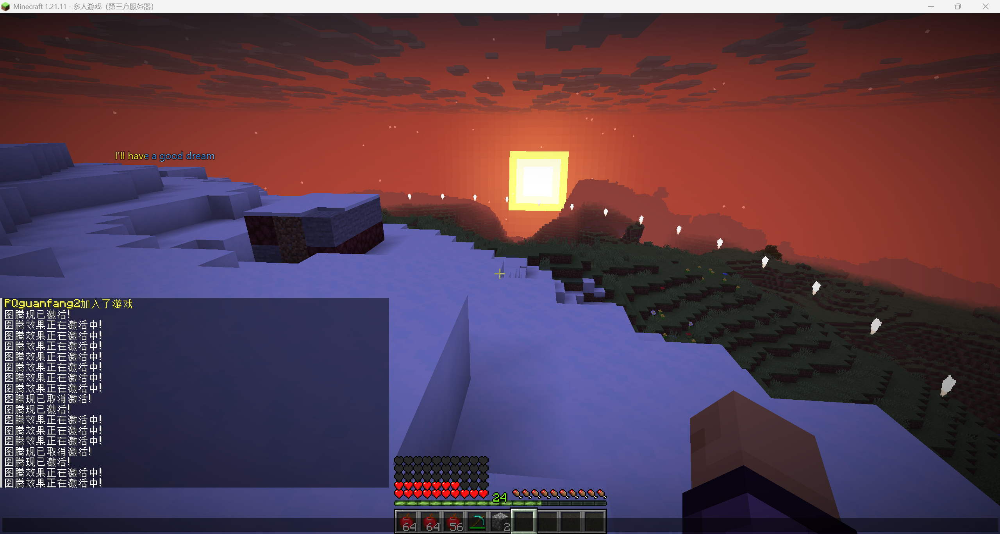

# ✨Bonus Effects for Totem

```yaml
bonus-effects:
  enabled: true
  default-level: 1
  max-level: 5
  # group: 'advanced'

  1:
    range: 16
    period-ticks: 60

    price:
      material: diamond
      amount: 64
      placeholder: 'Diamond x{amount}'

    description: '10 Health + Each 3 seconds give 1 apple'

    effects:
      enabled: true
      1:
        type: MythicMobs
        modifier-type: ADD
        stat: HEALTH
        value: 10

    apply-actions:
      1:
        type: message
        message: "§aLv1 Totem start！"

    remove-actions:
      1:
        type: message
        message: "§cLv1 Totem end！"

    circle-actions:
      1:
        type: give_item
        item:
          material: apple


  2:
    range: 20
    period-ticks: 40

    price:
      material: diamond
      amount: 128
      placeholder: 'Diamond x{amount}'

    description: '15 Health + Each 2 seconds give 1 golden apple'

    effects:
      enabled: true

      1:
        type: MythicMobs
        modifier-type: ADD
        stat: HEALTH
        value: 15

    apply-actions:
      1:
        type: message
        message: "§bLv2 Totem start！"

    remove-actions:
      1:
        type: message
        message: "§7Lv2 Totem ended！"

    circle-actions:
      1:
        type: give_item
        item:
          material: golden_apple


  3:
    range: 30
    period-ticks: 20

    price:
      material: diamond
      amount: 256
      placeholder: 'Diamond x{amount}'

    description: '20 Health + Each 1 second give 1 enchanted golden apple'

    effects:
      enabled: true
      1:
        type: MythicMobs
        modifier-type: ADD
        stat: HEALTH
        value: 20

    apply-actions:
      1:
        type: message
        message: "§6Lv3 Ultimate Totem Start！"

    remove-actions:
      1:
        type: message
        message: "§8Ultimate Totem ended！"

    circle-actions:
      1:
        type: give_item
        item:
          material: enchanted_golden_apple
```

## Note

* All options in this page require restart the server to take effect.
* Make sure you disable `disappear` option in your totem configs to use this feature.
* Make sure your totem layout must not include entity.
* This feature does not support **Folia** servers.
* This feature is disabled in `config.yml` and totem configs, you need enable them in both files if you want to use this feature.

## Enabled

Whether to enable this function.

## Default Level

The default level of the bonus after totem actived, default set to 1.

## Max Level

&#x20;The maximum level of the bonus totem can upgraded.

## Group

Set the group the totem, only use in limit feature.

## Each Level settings:

The section starting with the number **1** represents the bonus settings for the corresponding level. The numbers should be continuous and set up to the maximum level. If a level is exactly the same as the settings of the previous level, you can skip that level.

### Range

The range of the bonus effect. Support 2 formats:

```yaml
range: 16
```

### Price <mark style="color:red;">- PREMIUM</mark>

The price player need cost to upgrade to this level, you can check [this page](totem-config/prices-option-premium.md) for more info.

### Description

A message that display in totem GUI.

### Effects

Set libreforga effects or built-in bonus effect to this totem.

#### libreforge Effects <a href="#libreforge-effects" id="libreforge-effects"></a>

MythicTotem does not package libreforege, you have to purcahse any of Auxilor's plugin that package libreforage then install it in your server to make this work!

If you want to a totem has libreforge effects, you need do those things:

* Set `libreforge-hook` option in `config.yml` to `true`.
* Set `bonus-effects.effects.enabled` option in totem configs to `true`.&#x20;
* Add effects at `config.yml`'s libreforge-effects option. **Please note that effect ID must same as totem ID.**


If you have installed MythicPrefixes in your server, you must **make sure** none of the totem IDs conflict with the tag IDs in MythicPrefixes; otherwise, using this feature may cause issues.


An example:

```yaml
libreforge-effects:
  - id: default # Effect ID
    effects:
      - id: bonus_health
        args:
          health: 40
      - id: damage_multiplier
        args:
          multiplier: 4.0
        triggers:
          - melee_attack
    conditions: []
```

#### Built-in Effects <a href="#built-in-effects" id="built-in-effects"></a>

If you want to a totem has built-in effect bonus, you need do those things:

* Set `bonus-effects.effects.enabled` option in tag configs to `true`.
* Add below contents at your totem config if it is not exist.
* If you removed BUFF here, you need to restart the server.

**MythicLib**

Add stats from MythicLib plugin. (Support stats from MMOCore, MMOItems)

<pre class="language-yml"><code class="lang-yml">  effects:
    enabled: true
    1: 
<strong>      type: MythicLib
</strong>      stat: MAX_HEALTH # Stat ID
      value: 1 # Add value
    2: # More effects...
</code></pre>

**MythicMobs**

Add stats from MythicMobs plugin.

If you are getting **NoSuchMethod** error, this means you are using old version of MythicMobs, you need update it to **LATEST**. By default, all stats exist in MythicMobs are disabled, you need enable them in `plugins/MythicMobs/stats.yml` file or other stat configs.

```yml
  effects:
    enabled: true
    1: 
      type: MythicMobs
      modifier-type: SET # ADD, SET, MULTIPLY, COMPOUND
      stat: HEALTH
      value: 100
    2: # More effects...
```

**AuraSkills**

Add stats from AuraSkills plugin.

Since AuraSkills is saving the stat modifier, so if your server crash, totem bonus effects config change or other situations where the player's stat may not be cleared properly. Although MythicTotem consider this problem, if it still occur in your server: You can try restarting the server. If this does not solve the problem, you will have to use the `/skills modifier removeall` command for every players.

```yaml
  effects:
    enabled: false
    1:
      type: AuraSkills
      stat: HEALTH
      value: 100
    2: # More effects...
```

**Condition**

You can set condition for effects. Just try add `conditions` section here.

```yml
  effects:
    enabled: true
    1:
      type: MythicLib
      stat: MAX_HEALTH
      value: 100
      bypass-condition-after-apply: true
      conditions:
        1:
          type: world
          world: lobby
```

There is also a option called `bypass-condition-after-apply` option available, if set to `false`, plugin will auto remove effect if we found player no longer meet the condition of effect.

### Period Ticks

How often should the actions in "circle actions" be executed, in ticks.

### Apply Actions

The action executed when the totem effect actived.

### Remove Actions

The action executed when the totem effect removed.

### Circle Actions

The action executed between the totem effect active.

## Settings in config.yml file

```yml
bonus-effects:
  enabled: true
  check-radius: 10
  range-display:
    enabled: true
    particle: END_ROD
  limit:
    enabled: true
    value:
      default:
        default: 1
        vip: 2
      # Group ID
      # advanced:
      #   default: 1
      #   vip: 1
    conditions:
      vip:
        1:
          type: permission
          permission: 'group.vip'
    same-totem-only-active-once: true
  gui:
    enabled: true
    title: 'Totem Info'
    size: 27
    ignore-click-outside: false
    totem-info-item:
      slot: 11
      material: BEACON
      name: '&eTotem Info'
      lore:
        - '&7Totem ID: {totem_id}'
        - '&7Totem Range: {bonus_range}'
        - '&7Totem Level: {bonus_level}'
        - '&7Totem Bonus:'
        - '&7{bonus_description}'
        - '&bYou'
        - '&7Totem Limit: {bonus_limit}'
        - '&7Active Bonus Amount: {bonus_amount}'
    totem-upgrade-item:
      slot: 15
      material: EMERALD_BLOCK
      name: '&cUpgrade'
      lore:
        - '&7Upgrade Bonus:'
        - '&7{next_description}'
        - '&7Next Level: {next_level}'
        - '&7Price: {next_price}'
    totem-max-upgrade-item:
      material: BARRIER
      name: '&4MAX LEVEL'
      lore:
        - '&7Upgrade Bonus:'
        - '&7{bonus}'
```

### Enabled

Whether enable this feature.

### Check Radius

Each player checks the totems within a certain distance nearby. For example, this represents checking if there are valid totems only within a 10-square range nearby.

### Range Display

Support use particle to display totem range.

<figure><figcaption></figcaption></figure>

## Limit

By deafult, common player can only active 1 bonus totem, and players who have `group.vip` permission can active extra 1 bonus totem. This can be changed here.

The default section means: By default, the maximum limit shared by all bonus totems, this does not represent a group called `default`, and this section cannot be deleted.

The section below `default` are for different groups. You can set group at each bonus totem config.

## GUI

You can open GUI by clicking the totem blocks.
