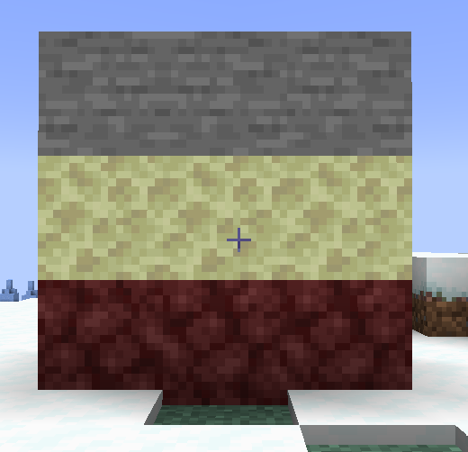

# 📚Example: Common 2D Totem

## Config

```yaml
mode: 'VERTICAL'
layout:
  - 'AAA'
  - 'BBB'
  - 'CCC'
explains:
  A: 'minecraft:stone'
  B: 'minecraft:end_stone'
  C: 'minecraft:netherrack'
actions:
  1:
    type: message
    message: 'Hello!'
  2:
    type: mythicmobs_spawn
    entity: CAVE_SPIDER
conditions: []
```

## In-game layout

<figure><figcaption></figcaption></figure>
